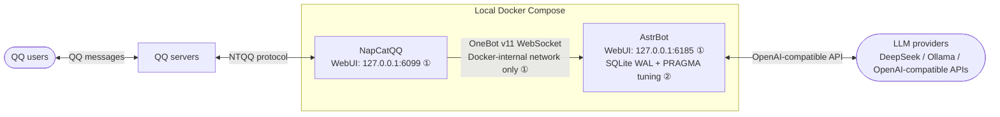
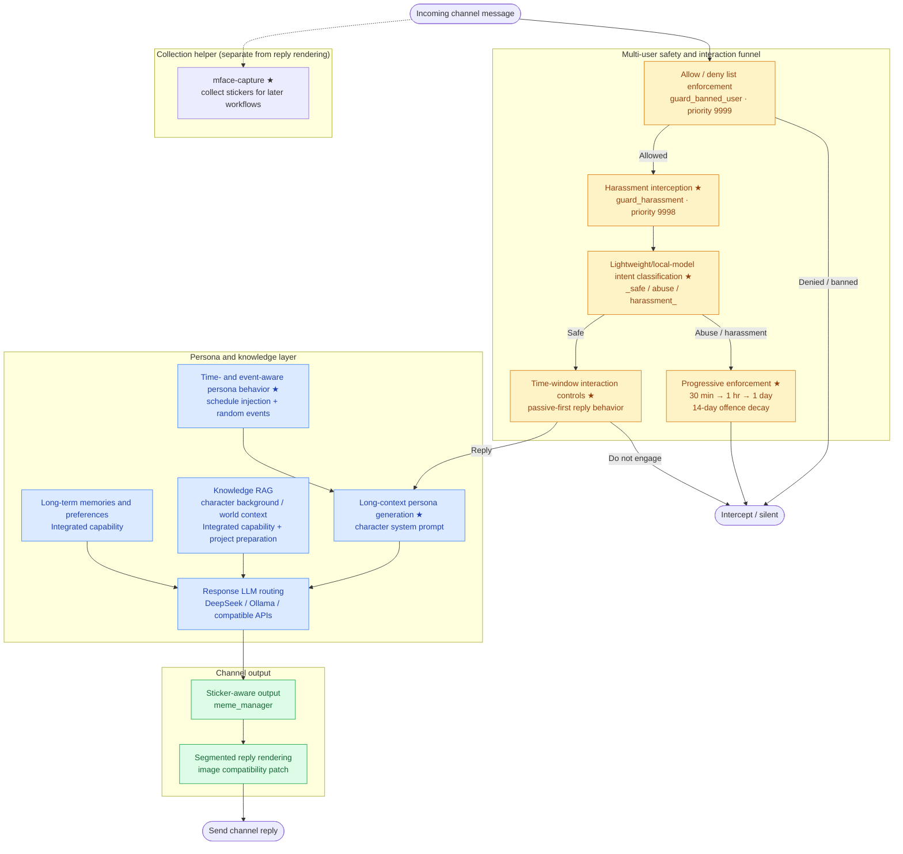

# Multi-Channel AI Chatbot Platform

[简体中文](README.zh-CN.md)

**Portfolio status: core implementation complete.**

A multi-user AI chatbot platform designed to make character-driven LLM interactions safe, useful, and operable in real communities. It combines policy-aware message handling, provider routing, long-context persona generation, retrieval-augmented knowledge, long-term preferences and memories, and deployment controls that keep a local bot dependable under real group-chat load.

QQ is the production-tested reference deployment. Discord has also completed end-to-end deployment and validation, demonstrating the platform's multi-channel design without overstating long-running Discord operating data.

## Why this platform

Single-user chatbot demos do not capture the hard parts of a community bot: one shared system must distinguish permitted users and unsafe messages, maintain a coherent persona over many turns, respect group context and user boundaries, and continue replying when several people interact with it. This project treats those concerns as one applied-AI system rather than as separate features.

The result is a reusable platform pattern for multi-user conversational agents: route each message through safety and interaction controls first, enrich an appropriate response with persona, retrieval, and memory context, then render an output suitable for the target channel.

## Operational evidence

- **Production-tested QQ reference deployment:** operated in a community with **5,000+ members**.
- **Observed operating period:** **5,689 requests over 22 days**, with **300+ active users** during that period.
- **Discord:** end-to-end deployment and validation completed; no claim is made for long-running Discord metrics.
- **Database reliability:** SQLite WAL plus targeted PRAGMA tuning resolved observed `database is locked` contention under multi-user load, without introducing new infrastructure.

## Applied AI system design

- **Multi-turn persona:** long-context system prompts keep character behavior consistent across conversations, with time-aware schedules and randomized events that give the persona bounded, believable state.
- **Knowledge preparation and RAG:** project-specific web data collection and knowledge preparation feed retrieval-augmented context for character background and world knowledge.
- **Long-term memory:** user preferences and persistent memories are incorporated into responses with explicit interaction boundaries. RAG and memory deeply integrate and extend existing framework/plugin capabilities rather than being represented as a framework built from scratch.
- **Model routing:** the platform supports OpenAI-compatible providers and local models, allowing separate lightweight/local classification and response-generation paths.

## Original contributions and extensions

**Project-specific**

- A multi-layer safety and interaction funnel: allow/deny enforcement, harassment interception, independent intent classification, progressive penalties, and time-window reply controls.
- A from-scratch web data collection and knowledge-preparation pipeline for persona-grounded retrieval.
- Time-aware, random-event persona behavior that keeps schedules and events within character constraints.
- [`plugins/mface-capture/`](plugins/mface-capture/), a QQ sticker-capture replacement plugin whose JSONL metadata omits chat text and sender IDs, and which supports emotion-label review. For deployments that enable optional local media capture, operator consent and retention controls are operational requirements; they are not enforced access controls in the plugin.
- Tests and operational configuration for JSONL metadata omission, label binding, state expiry, isolation, local-only interfaces, container readiness, and SQLite behavior.

**Substantial extensions inspired by upstream AstrBot plugins**

- [`plugins/enhance-mode/`](plugins/enhance-mode/) substantially redesigns and extends `astrbot_plugin_astrbot_enhance_mode`. Its core safety funnel and progressive enforcement behavior were user-designed.
- [`plugins/life-scheduler/`](plugins/life-scheduler/) substantially redesigns and extends `astrbot_plugin_life_scheduler`. Its core schedule and event behavior were user-designed.

**Integrated capabilities**

- AstrBot provides the multi-platform LLM and plugin framework; its ecosystem capabilities are integrated and extended here for RAG, memory, persona delivery, and channel adapters.
- OneBot v11 and NapCatQQ provide the QQ messaging integration used by the reference deployment.

## Reliability, privacy, and safety

- AstrBot and NapCat WebUIs bind to `127.0.0.1`; they are not exposed to the LAN by default.
- OneBot traffic remains on the Docker-internal network rather than being mapped to a host port.
- Container health-check dependencies prevent NapCat from starting before AstrBot is ready.
- `.env` and runtime data remain excluded from version control.
- SQLite WAL and targeted PRAGMA tuning address observed lock contention under multi-user writes.
- Raw survey data is not public.

## User-informed iteration

The interaction model was informed by **25 anonymized responses from 44 views** (about a **57% response rate**). **16 of 25 respondents (64%)** prioritized reliable reactive replies, while **15 of 25 (60%)** valued long-term preferences and memories. That feedback led to a passive-first, controllable interaction model and clear boundaries around when memory is used.

## Tech stack

- **Application and tests:** Python, pytest
- **Agent framework:** AstrBot multi-platform LLM and plugin framework
- **Channels and protocol:** NapCatQQ, OneBot v11
- **Models:** OpenAI-compatible APIs, DeepSeek, and local Ollama models
- **Knowledge and memory:** FAISS/RAG and integrated long-term memory capabilities
- **Persistence:** SQLite with WAL tuning
- **Operations:** Docker Compose, health checks, `.env` configuration

## Architecture context

### Reference deployment topology (QQ)



① [Local-only and internal-network isolation](#reliability-privacy-and-safety) ② [SQLite reliability tuning](#reliability-privacy-and-safety)

### Message-processing flow

`★ Project-specific or substantially redesigned contribution` · `Integrated capability` denotes framework or ecosystem functionality integrated into this system.

`mface-capture` is a collection helper for later meme/sticker workflows; it is not part of the reply-rendering path.



## Project structure

```text
.
├── docker-compose.yml
├── .env.example
├── .gitignore
├── README.md
├── LICENSE
├── scripts/
│   ├── start.ps1        # Windows: supports -Build
│   ├── stop.ps1
│   ├── start.sh         # Linux/macOS: supports --build / -b
│   └── stop.sh
├── patches/
│   ├── astrbot-sqlite-wal/       # AstrBot SQLite WAL tuning
│   │   ├── PATCH.md
│   │   └── sqlite.py
│   └── custome-segment-reply/    # Segmented-reply image compatibility fix
│       └── PATCH.md
├── plugins/
│   ├── enhance-mode/    # Safety funnel + progressive enforcement + time windows
│   ├── mface-capture/   # Original QQ sticker-capture plugin
│   └── life-scheduler/  # Schedule injection + character events
├── docs/
│   └── 表情系统与本地补丁记录_2026-05-15.md
├── data/
├── napcat/
│   └── config/
└── ntqq/
```

Directory purpose:

- `data/`: AstrBot persistent data.
- `napcat/config/`: NapCat configuration.
- `ntqq/`: QQ login state and cache.
- `patches/`: records of changes to upstream container images; mount them when needed.
- `.env`: local private configuration, ignored by `.gitignore`.

## 1. Install Docker Desktop

Windows / macOS:

1. Download and install [Docker Desktop](https://www.docker.com/products/docker-desktop/).
2. Start Docker Desktop.
3. Confirm that Docker Engine is running.

Linux:

1. Follow Docker's official documentation to install Docker Engine and the Docker Compose plugin.
2. Confirm that the current user can run `docker compose version`.

## 2. Prepare the environment file

Copy the template:

Windows PowerShell:

```powershell
Copy-Item .env.example .env
```

Linux/macOS:

```sh
cp .env.example .env
```

Then open `.env` and retain or change only the values you need. Do not put real API keys in `.env.example`.

On Linux/macOS, set `NAPCAT_UID` and `NAPCAT_GID` to:

```sh
id -u
id -g
```

## 3. Start the services

The first start pulls Docker images and requires network access. Run it manually only after you have decided to allow network access.

Windows PowerShell:

```powershell
.\scripts\start.ps1
# Force an image rebuild: .\scripts\start.ps1 -Build
```

Linux/macOS:

```sh
chmod +x scripts/start.sh scripts/stop.sh
./scripts/start.sh
# Force an image rebuild: ./scripts/start.sh --build
```

You can also run:

```sh
docker compose --env-file .env up -d
```

View logs:

```sh
docker compose logs -f astrbot
docker compose logs -f napcat
```

## 4. Open the AstrBot WebUI

Open in a browser:

```text
http://localhost:6185
```

Default credentials:

```text
Username: astrbot
Password: astrbot
```

Change the administrator password immediately after the first login.

## 5. Log in to NapCatQQ

Open in a browser:

```text
http://localhost:6099/webui
```

If the page requires a token, view the NapCat logs:

```sh
docker compose logs -f napcat
```

Log in by scanning the QR code with a dedicated QQ bot account. Do not test automated replies with your primary account.

## 6. Configure the OneBot v11 connection

In the AstrBot WebUI:

1. Open `Bots` in the left sidebar.
2. Click `+ Create Bot`.
3. Choose `OneBot v11`.
4. Set `ID` to `napcat-local` if desired.
5. Enable it.
6. Set the reverse WebSocket host address to `0.0.0.0`.
7. Set the reverse WebSocket port to `6199`.
8. If a token is configured, it must match on both AstrBot and NapCat; otherwise leave it empty.
9. Save.

In the NapCat WebUI:

1. Open `Network Configuration`.
2. Create a connection and choose `WebSockets Client`.
3. Enable it.
4. Set the URL to:

```text
ws://astrbot:6199/ws
```

5. Set the heartbeat and reconnect intervals to `1000` milliseconds initially.
6. Save.

After the connection succeeds, the AstrBot console should show a log similar to `aiocqhttp(OneBot v11) adapter connected`.

`docker-compose.yml` does not expose `6199` to the host. NapCat and AstrBot communicate only on the Compose-internal network, which is safer for local testing.

## 7. Configure an LLM provider

In the AstrBot WebUI, open the provider or large-language-model configuration page and create a configuration for your provider.

OpenAI-compatible API / DeepSeek:

- Choose an OpenAI or OpenAI-compatible format when applicable.
- Use your own API key.
- Set the API Base URL according to the provider documentation, for example the OpenAI-compatible address from the DeepSeek console.
- Enter the model ID supplied by the provider.

Local Ollama:

1. Install Ollama on the host.
2. Pull and run a model, for example:

```sh
ollama pull deepseek-r1:8b
ollama run deepseek-r1:8b
```

3. When AstrBot runs in Docker Desktop on Windows/macOS, the API Base URL is usually:

```text
http://host.docker.internal:11434/v1
```

4. For Linux Docker, refer to AstrBot's official Ollama documentation. A common value is:

```text
http://172.17.0.1:11434/v1
```

## 8. Test direct and group chats

Direct-chat test:

1. Send a simple message to the QQ bot account from another QQ account.
2. Confirm that AstrBot receives the event in its console.
3. Confirm that the bot replies as expected.

Group-chat test:

1. Add the QQ bot account to a test group.
2. Test in a small group first; do not place it directly in a large group.
3. Test replies using AstrBot's wake-word, permission, and plugin settings.
4. Watch for flooding, duplicate replies, or permission issues.

## 9. Stop the services

Windows PowerShell:

```powershell
.\scripts\stop.ps1
```

Linux/macOS:

```sh
./scripts/stop.sh
```

Or run:

```sh
docker compose --env-file .env down
```

## Security guide

- Use a dedicated QQ bot account, not your primary account.
- Do not expose AstrBot WebUI, NapCat WebUI, or OneBot ports to the public internet.
- This template binds WebUI ports only to `127.0.0.1` by default.
- Store API keys only in `.env` or AstrBot local configuration; never place them in this README, scripts, or `.env.example`.
- Do not upload `.env` to GitHub; this project ignores it through `.gitignore`.
- Apply reply rate limits and test within a small audience first.
- Initially disable high-risk plugins, especially those that can execute commands, access files, browse the web, or send messages in bulk.
- The WebUI default password is for first login only; change it immediately after startup.
- When using a OneBot token, use a long random string and ensure it matches in AstrBot and NapCat.

## Troubleshooting

### NapCat cannot connect to AstrBot

Check:

- The AstrBot OneBot v11 bot is enabled.
- The AstrBot reverse WebSocket port is `6199`.
- The NapCat WebSocket client URL is `ws://astrbot:6199/ws`.
- Both containers are running: `docker compose ps`.
- The AstrBot console for connection or timeout logs.

### The browser cannot open a WebUI

Check:

- Docker Desktop is running.
- The containers are up: `docker compose ps`.
- The local port is not already in use.
- If you changed a port in `.env`, use the changed port in the browser.

### Keep every WebUI off the LAN

Keep the port bindings in `docker-compose.yml` as `127.0.0.1:host-port:container-port`. Do not change them to `0.0.0.0:host-port:container-port` or `host-port:container-port` unless you fully understand the security implications.

## References

- [AstrBot Docker deployment](https://docs.astrbot.app/deploy/astrbot/docker.html)
- [AstrBot OneBot v11](https://docs.astrbot.app/platform/aiocqhttp.html)
- [AstrBot management panel](https://docs.astrbot.app/use/webui.html)
- [AstrBot model providers](https://docs.astrbot.app/en/config/providers/start.html)
- [AstrBot Ollama](https://docs.astrbot.app/config/providers/provider-ollama.html)
- [NapCatQQ OneBot network basics](https://www.napcat.wiki/onebot/network)
- [NapCat-Docker Compose template](https://raw.githubusercontent.com/NapNeko/NapCat-Docker/main/compose/astrbot.yml)

## License

[MIT](LICENSE) © 2026 [Junliang-Lyu](https://github.com/Junliang-Lyu)
