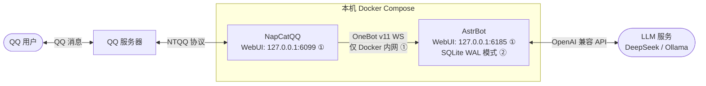
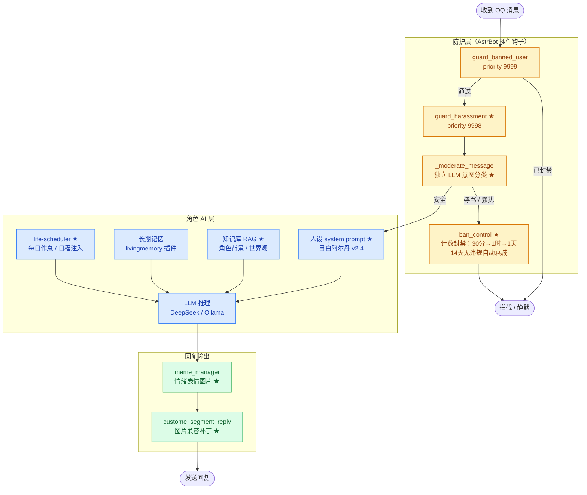

# QQ AI 聊天机器人本地部署模板

> **Portfolio status** — 本项目核心部署模板和插件已完成，当前作为稳定作品集项目展示；后续改进方向记录在下方。

English summary: Docker Compose template and plugin suite for local **AstrBot + NapCatQQ** AI chatbot deployment, with OneBot v11 WebSocket messaging, OpenAI-compatible LLM backends, local-only WebUI binding, moderation plugins, sticker capture, and SQLite WAL tuning.

通过 Docker Compose 在本机一键部署 **AstrBot + NapCatQQ**，接入 OpenAI 兼容 API 或本地 Ollama，让 QQ 小号成为 AI 聊天机器人。

## 架构图

### 部署拓扑



① [安全隔离](#本项目贡献点)　② [SQLite WAL 优化](#本项目贡献点)

### 消息处理流水线



> **图例**：黄色 = 防护层　蓝色 = 角色 AI　绿色 = 回复输出　★ = 本项目新增 / 改造

## 技术栈

- **AstrBot** — AI 机器人框架，支持多模型、角色人格、插件扩展
- **NapCatQQ** — 基于 NTQQ 的 QQ 协议实现
- **OneBot v11** — 机器人通信协议，NapCat 作反向 WebSocket 客户端连接 AstrBot
- **Docker Compose** — 双容器编排，桥接网络隔离，healthcheck 保障启动顺序
- **OpenAI 兼容 API** — 支持 DeepSeek、本地 Ollama 等多种 LLM 后端

## 本项目贡献点

### ① 骚扰防护体系（[`plugins/enhance-mode/`](plugins/enhance-mode/)）

基于 astrbot_plugin_astrbot_enhance_mode 扩展，新增：

- **LLM 审核层**：消息进入角色 LLM 前，先用独立 LLM 调用做意图分类（安全 / 辱骂 / 性骚扰），管理员豁免
- **渐进式封禁**：首次 30 分钟 → 再犯 1 小时 → 三犯起 1 天，14 天无违规自动衰减归零，SQLite 跨会话持久化
- **LLM 工具改造**：`enhance_ban_user` 移除 duration 参数，时长完全由前科计数自动决定；新增 `enhance_get_offense_count` 让角色可主动查询前科

### ② QQ 表情采集插件（[`plugins/mface-capture/`](plugins/mface-capture/)）

从零写的 AstrBot 插件，让角色能用 QQ 表情包回复：

- 采集用户发来的 `mface` / `image` 消息段并落盘，数据脱敏（不保存 QQ 号、群号、URL 鉴权参数）
- 配套 `generate_mface_label_manifest.py` 生成带情绪标签的 CSV，供批量核查和手动补标
- 配套单元测试覆盖脱敏逻辑、标签绑定、`CaptureState` 自动过期和 source_origin 隔离

### ③ 安全隔离配置

- WebUI 端口（6099、6185）绑定 `127.0.0.1`，不暴露到局域网
- OneBot 通信端口（6199）仅在 Docker 内部网络存在，不映射到宿主机
- NapCat 容器等待 AstrBot 健康就绪后再启动（`condition: service_healthy`）
- `.env` 与运行时数据通过 `.gitignore` 完全排除出版本控制

### ④ SQLite WAL 模式优化（[`patches/astrbot-sqlite-wal/`](patches/astrbot-sqlite-wal/)）

AstrBot 默认 SQLite journal 模式在并发写入时偶发 `database is locked`，导致对话响应失败。
对 `initialize()` 追加了 WAL 模式及五条性能 PRAGMA，消除了该问题。

### ⑤ 角色日程插件（[`plugins/life-scheduler/`](plugins/life-scheduler/)）

基于 astrbot_plugin_life_scheduler 改写，让角色拥有连续的"生活"状态：

- **作息骨架**：按星期几生成固定日程框架（工作日上课+训练 / 周六轻量训练+自由 / 周日休息），约束 LLM 不生成脱离角色设定的内容
- **角色事件系统**：30% 概率触发特殊事件，其中 50% 为角色间互动事件（从 Uma Musume 角色名册按权重抽取）
- **时段概率门**：在 enhance-mode 中配合实现，午休和晚间恢复正常回复频率，深夜/上课时段降低主动回复概率

## 数据复盘

**初步观察：** 早期用户因新鲜感使用频率较高，新鲜感消退后使用意愿明显下降。
在熟人社交（QQ）场景中，AI 聊天机器人缺乏持续使用的刚性需求，
娱乐向机器人的留存率有天然上限。

为保护隐私，公开仓库不包含 QQ 号、群号、原始聊天内容、API Key、WebSocket token 或运行时数据库。可公开复盘的指标建议只保留聚合层级，例如运行天数、测试群规模区间、消息量区间、主要故障类型和修复结果。

## 欢迎继续开发

如果你有兴趣在此基础上继续，以下方向值得探索：

- 增加定时推送、群公告、签到等实用功能
- 接入更多 LLM 后端（Claude、Gemini 等）
- 做更完善的角色人格配置和跨会话记忆机制
- 改造为多账号 / 多群管理模板

欢迎 Fork 或提 Issue。

---

## 项目结构

```text
.
├── docker-compose.yml
├── .env.example
├── .gitignore
├── README.md
├── LICENSE
├── scripts/
│   ├── start.ps1        # Windows：支持 -Build 参数
│   ├── stop.ps1
│   ├── start.sh         # Linux/macOS：支持 --build / -b 参数
│   └── stop.sh
├── patches/
│   ├── astrbot-sqlite-wal/       # AstrBot SQLite WAL 模式优化
│   │   ├── PATCH.md
│   │   └── sqlite.py
│   └── custome-segment-reply/    # 分段回复插件图片兼容修复
│       └── PATCH.md
├── plugins/
│   ├── enhance-mode/    # 骚扰防护：LLM 审核层 + 渐进式封禁 + 时段概率门（改自 astrbot_plugin_astrbot_enhance_mode）
│   ├── mface-capture/   # QQ 表情采集插件（原创）
│   └── life-scheduler/  # 角色日程注入：作息骨架 + 角色事件系统（改自 astrbot_plugin_life_scheduler）
├── docs/
│   └── 表情系统与本地补丁记录_2026-05-15.md
├── data/
├── napcat/
│   └── config/
└── ntqq/
```

目录用途：

- `data/`：AstrBot 持久化数据。
- `napcat/config/`：NapCat 配置。
- `ntqq/`：QQ 登录状态和缓存。
- `patches/`：对上游容器镜像的改动记录，可按需挂载。
- `.env`：本地私密配置文件，已被 `.gitignore` 忽略。

## 1. 安装 Docker Desktop

Windows / macOS：

1. 从 [Docker Desktop 官网](https://www.docker.com/products/docker-desktop/) 下载并安装。
2. 启动 Docker Desktop。
3. 确认 Docker Engine 正在运行。

Linux：

1. 按 Docker 官方文档安装 Docker Engine 和 Docker Compose 插件。
2. 确认当前用户可以运行 `docker compose version`。

## 2. 准备环境文件

复制模板：

Windows PowerShell：

```powershell
Copy-Item .env.example .env
```

Linux/macOS：

```sh
cp .env.example .env
```

然后打开 `.env`，只保留或修改你需要的值。不要把真实 API Key 写进 `.env.example`。

Linux/macOS 推荐把 `NAPCAT_UID` 和 `NAPCAT_GID` 改成：

```sh
id -u
id -g
```

## 3. 启动服务

首次启动会拉取 Docker 镜像，需要网络。请在你确认允许联网后手动运行。

Windows PowerShell：

```powershell
.\scripts\start.ps1
# 强制重新构建镜像：.\scripts\start.ps1 -Build
```

Linux/macOS：

```sh
chmod +x scripts/start.sh scripts/stop.sh
./scripts/start.sh
# 强制重新构建镜像：./scripts/start.sh --build
```

也可以直接运行：

```sh
docker compose --env-file .env up -d
```

查看日志：

```sh
docker compose logs -f astrbot
docker compose logs -f napcat
```

## 4. 打开 AstrBot WebUI

浏览器打开：

```text
http://localhost:6185
```

默认账号密码：

```text
用户名：astrbot
密码：astrbot
```

首次登录后建议立即修改管理密码。

## 5. 登录 NapCatQQ

浏览器打开：

```text
http://localhost:6099/webui
```

如果页面需要 token，请查看 NapCat 日志：

```sh
docker compose logs -f napcat
```

使用 QQ 小号扫码登录。不要使用主账号测试自动回复。

## 6. 配置 OneBot v11 连接

在 AstrBot WebUI：

1. 进入左侧 `机器人`。
2. 点击 `+ 创建机器人`。
3. 选择 `OneBot v11`。
4. `ID` 可填写 `napcat-local`。
5. 勾选启用。
6. 反向 WebSocket 主机地址填写 `0.0.0.0`。
7. 反向 WebSocket 端口填写 `6199`。
8. 如果你设置了 token，AstrBot 和 NapCat 两边必须一致；未设置则留空。
9. 保存。

在 NapCat WebUI：

1. 进入 `网络配置`。
2. 新建连接，选择 `WebSockets客户端`。
3. 勾选启用。
4. URL 填写：

```text
ws://astrbot:6199/ws
```

5. 心跳间隔和重连间隔可先设置为 `1000` 毫秒。
6. 保存。

连接成功后，在 AstrBot 控制台应能看到类似 `aiocqhttp(OneBot v11) 适配器已连接` 的日志。

说明：`docker-compose.yml` 没有把 `6199` 暴露到宿主机，只让 NapCat 和 AstrBot 在 Compose 内部网络通信。这样更适合本地安全测试。

## 7. 配置 LLM 提供商

在 AstrBot WebUI 中进入服务提供商或大语言模型配置页面，按你的提供商新增配置。

OpenAI 兼容 API / DeepSeek：

- 类型通常选择 OpenAI 或 OpenAI 兼容格式。
- API Key 使用你自己的密钥。
- API Base URL 按服务商文档填写，例如 DeepSeek 官方控制台给出的 OpenAI 兼容地址。
- 模型名填写服务商提供的模型 ID。

本地 Ollama：

1. 在宿主机安装 Ollama。
2. 拉取并运行模型，例如：

```sh
ollama pull deepseek-r1:8b
ollama run deepseek-r1:8b
```

3. 如果 AstrBot 运行在 Windows/macOS Docker Desktop 中，API Base URL 通常填写：

```text
http://host.docker.internal:11434/v1
```

4. Linux Docker 环境可参考 AstrBot 官方 Ollama 文档，常见写法是：

```text
http://172.17.0.1:11434/v1
```

## 8. 测试私聊和群聊

私聊测试：

1. 用另一个 QQ 账号给机器人小号发送一句简单消息。
2. 查看 AstrBot 控制台是否收到事件。
3. 确认机器人是否按预期回复。

群聊测试：

1. 把 QQ 小号加入测试群。
2. 先在小群中测试，不要直接放进大群。
3. 根据 AstrBot 的唤醒词、权限和插件设置测试回复。
4. 观察是否有刷屏、重复回复或权限问题。

## 9. 停止服务

Windows PowerShell：

```powershell
.\scripts\stop.ps1
```

Linux/macOS：

```sh
./scripts/stop.sh
```

或直接运行：

```sh
docker compose --env-file .env down
```

## 安全建议

- 使用 QQ 小号，不要使用主账号。
- 不要把 AstrBot WebUI、NapCat WebUI 或 OneBot 端口暴露到公网。
- 本模板默认只把 WebUI 端口绑定到 `127.0.0.1`。
- API Key 只放在 `.env` 或 AstrBot 本地配置中，不要写入 README、脚本或 `.env.example`。
- 不要上传 `.env` 到 GitHub；本项目已在 `.gitignore` 中忽略 `.env`。
- 为机器人回复设置频率限制，先在小范围测试。
- 初期禁用高风险插件，尤其是能执行命令、访问文件、主动联网或批量发消息的插件。
- WebUI 默认密码仅用于首次登录，启动后应立即修改。
- 如果配置 OneBot token，请使用随机长字符串，并确保 AstrBot 和 NapCat 两端一致。

## 常见问题

### NapCat 连不上 AstrBot

检查：

- AstrBot OneBot v11 机器人是否已启用。
- AstrBot 反向 WebSocket 端口是否是 `6199`。
- NapCat WebSocket 客户端 URL 是否是 `ws://astrbot:6199/ws`。
- 两个容器是否都在运行：`docker compose ps`。
- AstrBot 控制台是否有连接或超时日志。

### 浏览器打不开 WebUI

检查：

- Docker Desktop 是否运行。
- 容器是否启动：`docker compose ps`。
- 本机端口是否被占用。
- 如果你改了 `.env` 中的端口，请使用改后的端口访问。

### 不想暴露任何 WebUI 到局域网

保持 `docker-compose.yml` 中的端口绑定为 `127.0.0.1:端口:容器端口`。不要改成 `0.0.0.0:端口:容器端口` 或 `端口:容器端口`，除非你明确知道风险。

## 参考链接

- [AstrBot Docker 部署](https://docs.astrbot.app/deploy/astrbot/docker.html)
- [AstrBot 接入 OneBot v11](https://docs.astrbot.app/platform/aiocqhttp.html)
- [AstrBot 管理面板](https://docs.astrbot.app/use/webui.html)
- [AstrBot 接入模型服务](https://docs.astrbot.app/en/config/providers/start.html)
- [AstrBot 接入 Ollama](https://docs.astrbot.app/config/providers/provider-ollama.html)
- [NapCatQQ OneBot 网络基础](https://www.napcat.wiki/onebot/network)
- [NapCat-Docker 官方 Compose 模板](https://raw.githubusercontent.com/NapNeko/NapCat-Docker/main/compose/astrbot.yml)

## License

[MIT](LICENSE) © 2026 [Junliang-Lyu](https://github.com/Junliang-Lyu)
