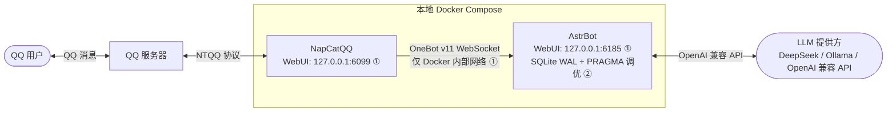
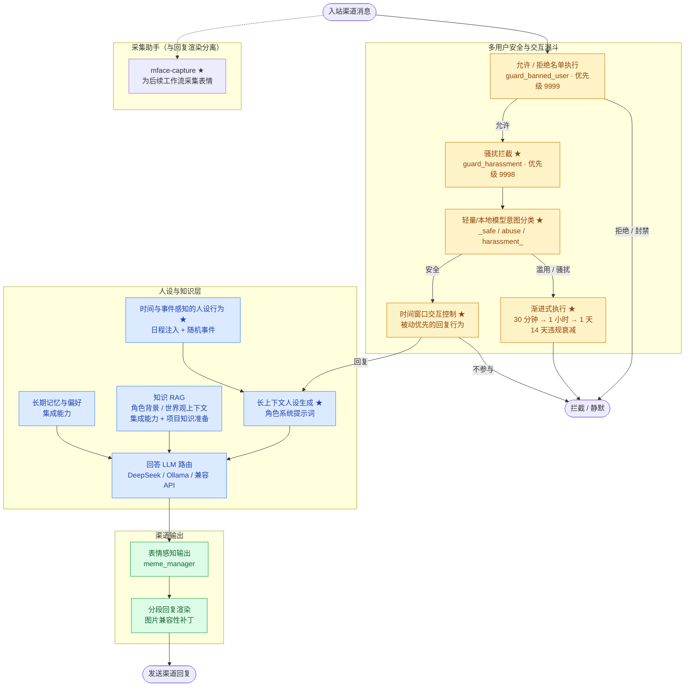

# 多渠道 AI 聊天机器人平台

[English](README.md)

**作品集状态：核心实现已完成。**

这是一个面向真实社区的多用户 AI 聊天机器人平台，旨在让角色驱动的 LLM 交互兼具安全性、实用性与可运维性。它将策略感知的消息处理、模型提供方路由、长上下文人设生成、检索增强知识、长期偏好与记忆，以及让本地机器人能够在真实群聊负载下稳定运行的部署控制整合在一起。

QQ 是经过生产环境验证的参考部署。Discord 也已完成端到端部署与验证，展示了平台的多渠道设计；但这里不会夸大为 Discord 具备长期运行数据。

## 为什么要做这个平台

单用户聊天机器人演示并不能覆盖社区机器人真正棘手的问题：一个共享系统必须识别获准用户与不安全消息，在多轮交互中维持连贯人设，尊重群聊上下文和用户边界，并在多人同时互动时持续作答。本项目将这些问题视为一个完整的应用型 AI 系统，而非互不关联的功能集合。

由此形成了一种可复用的多用户对话智能体模式：每条消息先经过安全与交互控制；适合回复时，再用人设、检索和记忆上下文增强回答；最后渲染为适合目标渠道的输出。

## 运行证据

- **经过生产验证的 QQ 参考部署：**运行于一个拥有 **5,000+ 成员**的社区。
- **观测运行周期：**在 **22 天内处理 5,689 次请求**，该期间有 **300+ 活跃用户**。
- **Discord：**已完成端到端部署与验证；不对 Discord 的长期运行指标作任何声明。
- **数据库可靠性：**SQLite WAL 与针对性的 PRAGMA 调优，解决了多用户负载下已观测到的 `database is locked` 竞争，且未增加新的基础设施。

## 应用型 AI 系统设计

- **多轮人设：**长上下文系统提示词使角色在多次对话中保持一致；结合时间感知日程与随机事件，让人设拥有受约束且可信的状态。
- **知识准备与 RAG：**项目专用的网页数据采集和知识准备流程，为角色背景与世界观知识提供检索增强上下文。
- **长期记忆：**用户偏好和持久记忆会在明确的交互边界内纳入回答。RAG 与记忆深度集成并扩展了已有框架/插件能力，并非从零构建的框架。
- **模型路由：**平台支持 OpenAI 兼容提供方和本地模型，因此可以将轻量/本地分类路径与回答生成路径分开。

## 原创贡献与扩展

**项目专属**

- 多层安全与交互漏斗：允许/拒绝名单执行、骚扰拦截、独立意图分类、渐进式处罚和时间窗口回复控制。
- 从零实现的网页数据采集与知识准备流程，用于以人设为基础的检索。
- 时间感知、随机事件的人设行为，使日程和事件始终处于角色约束内。
- [`plugins/mface-capture/`](plugins/mface-capture/)：原创 QQ 表情采集替代插件，其 JSONL 元数据不包含聊天文本或发送者 ID，并支持情绪标签审核。可选的采集媒体默认持久保存在本地；知情同意与依照留存政策手动清理属于部署运营要求，而不是插件强制执行的访问控制。
- 针对 JSONL 元数据字段排除（不记录聊天文本和发送者 ID）、标签绑定、状态过期、隔离、仅本地接口、容器就绪和 SQLite 行为的测试与运行配置。

**受上游 AstrBot 插件启发的大幅扩展**

- [`plugins/enhance-mode/`](plugins/enhance-mode/) 对 `astrbot_plugin_astrbot_enhance_mode` 进行了大幅重新设计和扩展。其核心安全漏斗和渐进式执行行为由用户设计。
- [`plugins/life-scheduler/`](plugins/life-scheduler/) 对 `astrbot_plugin_life_scheduler` 进行了大幅重新设计和扩展。其核心日程与事件行为由用户设计。

**集成能力**

- AstrBot 提供多平台 LLM 与插件框架；这里在其生态能力之上集成并扩展了 RAG、记忆、人设交付和渠道适配器。
- OneBot v11 与 NapCatQQ 提供 QQ 参考部署所使用的消息集成。

## 可靠性、隐私与安全

- AstrBot 和 NapCat WebUI 绑定到 `127.0.0.1`，默认不暴露到局域网。
- OneBot 流量保留在 Docker 内部网络中，不映射到宿主机端口。
- 容器健康检查依赖关系确保 AstrBot 就绪前不会启动 NapCat。
- `.env` 和运行时数据不纳入版本控制。
- SQLite WAL 与针对性的 PRAGMA 调优处理多用户写入中已观测到的锁竞争。
- 原始问卷数据不公开。

## 基于用户反馈的迭代

交互模型参考了 **44 次浏览中的 25 份匿名反馈**（约 **57% 回复率**）。其中 **25 名受访者中的 16 名（64%）**优先关注可靠的被动响应，**15 名（60%）**重视长期偏好与记忆。这些反馈促成了被动优先、可控的交互模型，以及记忆何时使用的明确边界。

## 技术栈

- **应用与测试：**Python、pytest
- **智能体框架：**AstrBot 多平台 LLM 与插件框架
- **渠道与协议：**NapCatQQ、OneBot v11
- **模型：**OpenAI 兼容 API、DeepSeek 与本地 Ollama 模型
- **知识与记忆：**FAISS/RAG 与集成式长期记忆能力
- **持久化：**采用 WAL 调优的 SQLite
- **运维：**Docker Compose、健康检查、`.env` 配置

## 架构背景

### 参考部署拓扑（QQ）



① [仅本地与内部网络隔离](#可靠性隐私与安全) ② [SQLite 可靠性调优](#可靠性隐私与安全)

### 消息处理流程

`★ 项目专属或经过大幅重新设计的贡献` · `集成能力` 表示集成到本系统中的框架或生态功能。

`mface-capture` 是为后续梗图/表情工作流准备的采集助手；它不属于回复渲染路径。



## 项目结构

```text
.
├── docker-compose.yml
├── .env.example
├── .gitignore
├── README.md
├── LICENSE
├── scripts/
│   ├── start.ps1        # Windows：支持 -Build
│   ├── stop.ps1
│   ├── start.sh         # Linux/macOS：支持 --build / -b
│   └── stop.sh
├── patches/
│   ├── astrbot-sqlite-wal/       # AstrBot SQLite WAL 调优
│   │   ├── PATCH.md
│   │   └── sqlite.py
│   └── custome-segment-reply/    # 分段回复图片兼容性修复
│       └── PATCH.md
├── plugins/
│   ├── enhance-mode/    # 安全漏斗 + 渐进式执行 + 时间窗口
│   ├── mface-capture/   # 原创 QQ 表情采集插件
│   └── life-scheduler/  # 日程注入 + 角色事件
├── docs/
│   └── 表情系统与本地补丁记录_2026-05-15.md
├── data/
├── napcat/
│   └── config/
└── ntqq/
```

目录用途：

- `data/`：AstrBot 持久化数据。
- `napcat/config/`：NapCat 配置。
- `ntqq/`：QQ 登录状态和缓存。
- `patches/`：对上游容器镜像所作修改的记录；按需挂载。
- `.env`：本地私有配置，已由 `.gitignore` 忽略。

## 1. 安装 Docker Desktop

Windows / macOS：

1. 下载并安装 [Docker Desktop](https://www.docker.com/products/docker-desktop/)。
2. 启动 Docker Desktop。
3. 确认 Docker Engine 正在运行。

Linux：

1. 按照 Docker 官方文档安装 Docker Engine 和 Docker Compose 插件。
2. 确认当前用户可以运行 `docker compose version`。

## 2. 准备环境文件

复制模板：

Windows PowerShell：

```powershell
Copy-Item .env.example .env
```

Linux/macOS：

```sh
cp .env.example .env
```

然后打开 `.env`，仅保留或更改你需要的值。不要把真实 API 密钥放进 `.env.example`。

在 Linux/macOS 上，将 `NAPCAT_UID` 和 `NAPCAT_GID` 设置为：

```sh
id -u
id -g
```

## 3. 启动服务

首次启动会拉取 Docker 镜像并需要网络访问。只有在你决定允许网络访问后，才手动执行启动。

Windows PowerShell：

```powershell
.\scripts\start.ps1
# 强制重建镜像：.\scripts\start.ps1 -Build
```

Linux/macOS：

```sh
chmod +x scripts/start.sh scripts/stop.sh
./scripts/start.sh
# 强制重建镜像：./scripts/start.sh --build
```

也可以运行：

```sh
docker compose --env-file .env up -d
```

查看日志：

```sh
docker compose logs -f astrbot
docker compose logs -f napcat
```

## 4. 打开 AstrBot WebUI

在浏览器中打开：

```text
http://localhost:6185
```

默认凭据：

```text
用户名：astrbot
密码：astrbot
```

首次登录后立即修改管理员密码。

## 5. 登录 NapCatQQ

在浏览器中打开：

```text
http://localhost:6099/webui
```

如果页面要求令牌，请查看 NapCat 日志：

```sh
docker compose logs -f napcat
```

使用专用 QQ 机器人账号扫描二维码登录。不要用主账号测试自动回复。

## 6. 配置 OneBot v11 连接

在 AstrBot WebUI 中：

1. 打开左侧边栏的 `Bots`。
2. 点击 `+ Create Bot`。
3. 选择 `OneBot v11`。
4. 如需要，将 `ID` 设为 `napcat-local`。
5. 启用它。
6. 将反向 WebSocket 主机地址设为 `0.0.0.0`。
7. 将反向 WebSocket 端口设为 `6199`。
8. 如果配置了令牌，AstrBot 与 NapCat 两端必须一致；否则留空。
9. 保存。

在 NapCat WebUI 中：

1. 打开 `Network Configuration`。
2. 新建连接并选择 `WebSockets Client`。
3. 启用它。
4. 将 URL 设为：

```text
ws://astrbot:6199/ws
```

5. 初始将心跳和重连间隔都设置为 `1000` 毫秒。
6. 保存。

连接成功后，AstrBot 控制台应显示类似 `aiocqhttp(OneBot v11) adapter connected` 的日志。

`docker-compose.yml` 不会将 `6199` 暴露给宿主机。NapCat 和 AstrBot 仅在 Compose 内部网络通信，这对本地测试更安全。

## 7. 配置 LLM 提供方

在 AstrBot WebUI 中，打开提供方或大语言模型配置页面，为你的提供方新建配置。

OpenAI 兼容 API / DeepSeek：

- 在适用时选择 OpenAI 或 OpenAI-compatible 格式。
- 使用你自己的 API 密钥。
- 按提供方文档设置 API Base URL，例如 DeepSeek 控制台提供的 OpenAI 兼容地址。
- 填写提供方给出的模型 ID。

本地 Ollama：

1. 在宿主机安装 Ollama。
2. 拉取并运行一个模型，例如：

```sh
ollama pull deepseek-r1:8b
ollama run deepseek-r1:8b
```

3. 当 AstrBot 运行在 Windows/macOS 的 Docker Desktop 中时，API Base URL 通常为：

```text
http://host.docker.internal:11434/v1
```

4. 对于 Linux Docker，请参阅 AstrBot 官方 Ollama 文档。一个常见值是：

```text
http://172.17.0.1:11434/v1
```

## 8. 测试私聊与群聊

私聊测试：

1. 使用另一个 QQ 账号向 QQ 机器人账号发送一条简单消息。
2. 确认 AstrBot 在控制台收到事件。
3. 确认机器人按预期回复。

群聊测试：

1. 将 QQ 机器人账号加入测试群。
2. 先在小群测试；不要直接放进大群。
3. 使用 AstrBot 的唤醒词、权限和插件设置测试回复。
4. 留意刷屏、重复回复或权限问题。

## 9. 停止服务

Windows PowerShell：

```powershell
.\scripts\stop.ps1
```

Linux/macOS：

```sh
./scripts/stop.sh
```

或运行：

```sh
docker compose --env-file .env down
```

## 安全指南

- 使用专用 QQ 机器人账号，不要使用主账号。
- 不要将 AstrBot WebUI、NapCat WebUI 或 OneBot 端口暴露到公共互联网。
- 此模板默认仅将 WebUI 端口绑定到 `127.0.0.1`。
- API 密钥只应保存在 `.env` 或 AstrBot 本地配置中；不要放进本 README、脚本或 `.env.example`。
- 不要将 `.env` 上传到 GitHub；本项目通过 `.gitignore` 忽略它。
- 设置回复速率限制，并先在小范围受众中测试。
- 起初禁用高风险插件，特别是可执行命令、访问文件、浏览网页或批量发送消息的插件。
- WebUI 默认密码仅供首次登录使用；启动后立即修改。
- 使用 OneBot 令牌时，请使用长随机字符串，并确保 AstrBot 与 NapCat 中一致。

## 故障排查

### NapCat 无法连接 AstrBot

检查：

- AstrBot 的 OneBot v11 机器人已启用。
- AstrBot 的反向 WebSocket 端口是 `6199`。
- NapCat WebSocket 客户端 URL 是 `ws://astrbot:6199/ws`。
- 两个容器都在运行：`docker compose ps`。
- AstrBot 控制台中是否存在连接或超时日志。

### 浏览器无法打开 WebUI

检查：

- Docker Desktop 正在运行。
- 容器已启动：`docker compose ps`。
- 本地端口没有被占用。
- 如果你在 `.env` 中更改了端口，请在浏览器中使用更改后的端口。

### 保证所有 WebUI 不暴露到局域网

保持 `docker-compose.yml` 中的端口绑定为 `127.0.0.1:host-port:container-port`。除非完全理解安全影响，否则不要改为 `0.0.0.0:host-port:container-port` 或 `host-port:container-port`。

## 参考资料

- [AstrBot Docker 部署](https://docs.astrbot.app/deploy/astrbot/docker.html)
- [AstrBot OneBot v11](https://docs.astrbot.app/platform/aiocqhttp.html)
- [AstrBot 管理面板](https://docs.astrbot.app/use/webui.html)
- [AstrBot 模型提供方](https://docs.astrbot.app/en/config/providers/start.html)
- [AstrBot Ollama](https://docs.astrbot.app/config/providers/provider-ollama.html)
- [NapCatQQ OneBot 网络基础](https://www.napcat.wiki/onebot/network)
- [NapCat-Docker Compose 模板](https://raw.githubusercontent.com/NapNeko/NapCat-Docker/main/compose/astrbot.yml)

## 许可证

[MIT](LICENSE) © 2026 [Junliang-Lyu](https://github.com/Junliang-Lyu)
