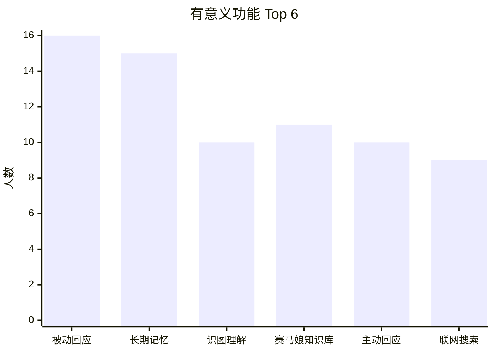
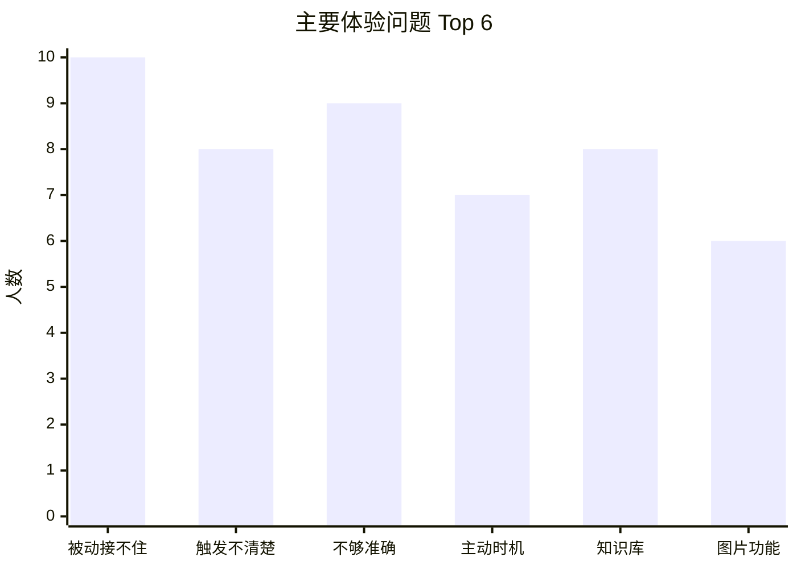
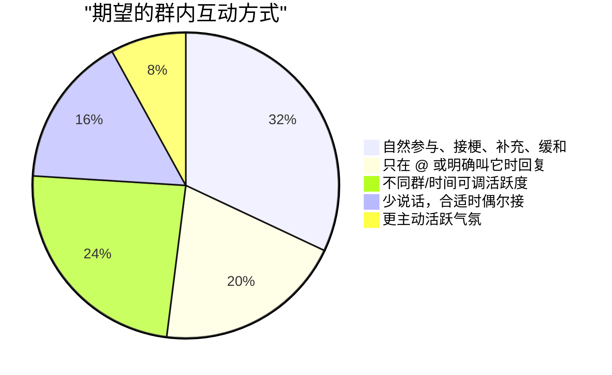

# QQ群机器人功能反馈问卷分析报告

样本量：25 份；问卷访问量：44 次；回收率：约 57%
答题时间：2026-05-18 10:29 至 2026-05-19 08:39
平均答题时长：134.8 秒；中位数：130 秒

说明：本报告只做聚合分析，不纳入 IP、UA、精确地理位置等个人标识字段。多选题占比不加总为 100%。

## 1. 总体结论

这次问卷的核心信号不是“继续堆更多功能”，而是：用户已经把阿尔丹当成群聊参与者来期待，最需要优先优化的是被动回应质量。

最明确的三点：

1. 被动回应是当前最值得优先修的能力。16/25 人（64%）认为“被 @、被问、有人 cue 它时能接住话”有意义，同时 10/25 人（40%）把“被动回应接不住话，容易答非所问”选为主要体验问题。
2. 用户希望它自然参与群聊，而不是只做工具。Q5 中最多人选择“可以自然参与群聊，接梗、补充信息、缓和情绪”（8/25，32%）。
3. 长期记忆和群内整理类功能有潜力，但前提是回复本身先自然。长期记忆在“有意义功能”里排名第二（15/25，60%），未来方向里“群内日报/周报”（10/25，40%）最高。

## 2. 样本构成

大多数答卷来自已经见过或用过阿尔丹的人，反馈可作为当前群内体验优化依据。

| 对阿尔丹了解程度 | 人数 | 占比 |
|---|---:|---:|
| 经常看到/用过几次 | 19 | 76.0% |
| 见过它回复，但没主动用过 | 2 | 8.0% |
| 知道有，但不太清楚能干什么 | 2 | 8.0% |
| 基本没注意到 | 2 | 8.0% |

## 3. 用户认为有意义的功能

| 功能 | 人数 | 占比 |
|---|---:|---:|
| 被动回应：被 @、被问、有人 cue 它时能接住话 | 16 | 64.0% |
| 长期记忆库：记住群里的梗、偏好、常聊内容 | 15 | 60.0% |
| 赛马娘知识库：查询角色、技能、支援卡、养成资料等 | 11 | 44.0% |
| 识图理解：看图片并解释、吐槽或回答相关问题 | 10 | 40.0% |
| 主动回应：看到合适话题时自己接话、补充、安慰或活跃气氛 | 10 | 40.0% |
| 联网搜索：临时查资料、查新闻、查不确定的信息 | 9 | 36.0% |
| B站总结：自动总结 B站视频/链接内容 | 6 | 24.0% |
| Bot 访问控制：限制某些人违规访问阿尔丹 | 4 | 16.0% |
| 表情包能力：找表情、发图、接梗、斗图 | 4 | 16.0% |
| 画图功能：通过外部画图 API 生成图片 | 3 | 12.0% |
| 点歌功能：在群里搜歌、点歌、分享音乐 | 2 | 8.0% |
| 目前还没感觉到特别有用的功能 | 2 | 8.0% |

## 4. 用户认为兴趣不大或不值得优先投入的功能

| 功能 | 人数 | 占比 |
|---|---:|---:|
| B站总结 | 9 | 36.0% |
| 都还可以，主要是需要优化 | 6 | 24.0% |
| 赛马娘知识库 | 5 | 20.0% |
| 点歌功能 | 5 | 20.0% |
| 主动回应 | 5 | 20.0% |
| 画图功能 | 4 | 16.0% |
| 联网搜索 | 4 | 16.0% |
| 被动回应 | 3 | 12.0% |
| Bot 访问控制 | 3 | 12.0% |
| 表情包能力 | 3 | 12.0% |
| 识图理解 | 1 | 4.0% |
| 我没怎么用过，不好判断 | 1 | 4.0% |
| 长期记忆库 | 0 | 0.0% |

净优先级按“有意义人数 - 不优先人数”粗略排序：

| 功能 | 有意义 | 不优先 | 净值 |
|---|---:|---:|---:|
| 长期记忆库 | 15 | 0 | +15 |
| 被动回应 | 16 | 3 | +13 |
| 识图理解 | 10 | 1 | +9 |
| 赛马娘知识库 | 11 | 5 | +6 |
| 联网搜索 | 9 | 4 | +5 |
| 主动回应 | 10 | 5 | +5 |
| Bot 访问控制 | 4 | 3 | +1 |
| 表情包能力 | 4 | 3 | +1 |
| 画图功能 | 3 | 4 | -1 |
| B站总结 | 6 | 9 | -3 |
| 点歌功能 | 2 | 5 | -3 |

这个排序说明：长期记忆和被动回应是最值得继续投入的两个方向；B站总结、点歌、纯画图的优先级相对低。

## 5. 当前最影响体验的问题

| 问题 | 人数 | 占比 |
|---|---:|---:|
| 被动回应接不住话，容易答非所问 | 10 | 40.0% |
| 回复不够准确，信息不够可靠 | 9 | 36.0% |
| 不清楚它具体能做什么/怎么触发 | 8 | 32.0% |
| 赛马娘知识库内容不全或不够新 | 8 | 32.0% |
| 主动回应时机不自然 | 7 | 28.0% |
| 识图、画图、表情包这类图片功能效果一般 | 6 | 24.0% |
| Bot 访问控制功能用途不清楚 | 3 | 12.0% |
| 回复速度慢或不稳定 | 3 | 12.0% |
| 担心隐私/长期记忆边界 | 2 | 8.0% |
| B站总结抓不住重点 | 1 | 4.0% |
| 联网搜索结果不够有用 | 1 | 4.0% |
| 点歌功能体验一般 | 1 | 4.0% |
| 其他 | 1 | 4.0% |

解读：

- “被动回应接不住话”排名第一，说明被 cue 时的即时回复质量比主动活跃更重要。
- “回复不够准确”排名第二；“不清楚能做什么/怎么触发”与“知识库内容不全或不够新”并列第三，说明用户还缺少可预期的使用方式。
- 主动回应不是没人要，但当前主要问题是时机不自然；不宜继续提高主动频率。

## 6. 用户希望的群内互动方式

| 互动方式 | 人数 | 占比 |
|---|---:|---:|
| 可以自然参与群聊，接梗、补充信息、缓和情绪 | 8 | 32.0% |
| 不同群/不同时间能设置不同活跃程度 | 6 | 24.0% |
| 只在被 @ 或明确叫它时回复 | 5 | 20.0% |
| 平时少说话，但看到很合适的话题可以偶尔接一句 | 4 | 16.0% |
| 可以更主动地活跃气氛 | 2 | 8.0% |

结论：用户不是简单要求“更主动”，而是希望“能接住”和“可控”。适合采用低频、被动优先、明确场景才主动的策略。

## 7. 未来拓展方向

| 方向 | 人数 | 占比 |
|---|---:|---:|
| 群内日报/周报：整理最近群里聊了什么、有哪些好玩的事 | 10 | 40.0% |
| 群聊档案馆：记录群里的名场面、梗、高光发言，后续可查询或回顾 | 9 | 36.0% |
| 游戏资料查询助手：查角色、配队、养成、材料、攻略、数据库 | 8 | 32.0% |
| 图片创作助手：画图、改图、生成梗图、把聊天内容做成图卡 | 8 | 32.0% |
| 二游资讯助手：游戏更新、活动、卡池、公告提醒 | 7 | 28.0% |
| 表情包/接梗助手：根据聊天语境找图、配图、斗图、补梗 | 6 | 24.0% |
| 音乐功能：点歌、歌单、音乐推荐 | 3 | 12.0% |
| 语音功能：语音识别、语音回复、角色语音 | 3 | 12.0% |
| 生活化助手：天气、日程提醒、每日新闻、简单备忘 | 3 | 12.0% |
| 群内活动助手：投票、报名、打卡、签到、活动提醒、结果统计 | 2 | 8.0% |
| 私聊功能：私聊查询资料、聊天、保存个人偏好 | 1 | 4.0% |
| 其他 | 1 | 4.0% |

解读：

- 群内日报/周报是最强新方向，但它依赖“群聊档案”和“长期记忆”的边界设计。
- 表情包/接梗助手的显性票数不是最高，但与“自然参与群聊”的主诉一致，可以作为被动回应优化的一部分，而不是单独大功能。
- 私聊、点歌、纯生活助手目前不是主要诉求。

## 8. 人设方向

| 人设方向 | 人数 | 占比 |
|---|---:|---:|
| 赛马娘 | 14 | 56.0% |
| 不太需要更多人设 | 12 | 48.0% |
| 鸣潮 | 3 | 12.0% |
| 明日方舟 | 2 | 8.0% |
| 其他 | 2 | 8.0% |
| 崩坏：星穹铁道 | 1 | 4.0% |
| 明日方舟：终末地 | 1 | 4.0% |
| 碧蓝档案 | 1 | 4.0% |
| 原神 | 0 | 0.0% |
| 绝区零 | 0 | 0.0% |
| 王者荣耀 | 0 | 0.0% |

结论：现阶段不宜把重点放在扩很多新人设。更稳的路线是先把当前阿尔丹的人设回复质量做扎实，再考虑赛马娘内部扩展。

## 9. 开放建议归纳

有效建议可以归为几类：

| 类别 | 反馈含义 | 处理建议 |
|---|---|---|
| 人设贴合 | 希望回复更贴合阿尔丹的人设 | 放入 P0：优化被动回复、人设表达和接梗机制 |
| 群内整理 | 希望有群聊内容整理与回顾 | 放入 P1/P2：群内日报/周报、名场面回顾 |
| 群内玩法 | 希望探索轻量的群内游戏互动 | 放入探索项：可先做轻量活动玩法设计 |
| 调侃互动 | 希望有更自然的玩笑与接梗互动 | 纳入接梗测试集：不当作严肃功能需求 |
| 访问控制 | 有人希望屏蔽特定用户 | 保留访问控制，但要解释用途和触发边界 |
| 成人向/擦边图片类请求 | 有少量 R18、站点、擦边图片诉求 | 不建议纳入群机器人主路线；需要明确拒绝或隔离 |
| 低信息反馈 | 缺少可行动的具体内容 | 不作为功能决策依据 |

## 10. 优先级建议

### P0：先修被动回复质量

目标：被 @、被问、被 cue 时先接住话，不答非所问，不硬查知识库，不硬贴红茶/训练/奔跑/甜点等角色道具。

建议动作：

- 增加被动回复意图分类：事实问题、普通吐槽、抽象发癫、调侃 bot、情绪低落、恶意骚扰。
- 普通闲聊和抽象发癫默认不走搜索、不走知识库长答。
- 增加“去道具化”规则：除非上下文提到比赛、训练、身体、目白家、茶点，否则不要主动提这些关键词。
- 增加接梗规则：短反应、半句、轻吐槽，不要每句都完整解释。
- 增加 20-30 条“难接话/抽象群聊”固定测试题。

### P1：调整主动回应和活跃度

目标：主动回应低频、可控、分群/分时间调节；不要用提高主动频率来掩盖被动回复问题。

建议动作：

- 保持“宁可少说”的主策略。
- 分场景配置活跃度：冷场、被 cue、知识问题、情绪安慰、纯闲聊分别处理。
- 对主动回复做观察台账：记录是否打断、是否接住、是否像阿尔丹。

### P1：完善记忆和群梗边界

目标：长期记忆要记稳定偏好和群梗，不记临时发癫、争吵、隐私。

建议动作：

- 记忆写入前先分类：长期偏好、稳定群梗、明确要求记住、临时玩笑、敏感信息。
- 群梗可以用于接梗，但不要把它写成“档案口吻”。
- 对隐私/长期记忆边界做简短说明，降低顾虑。

### P2：做群内日报/周报或名场面回顾

目标：响应最高票的未来方向，但必须先解决隐私和摘要质量。

建议动作：

- 先做只读、低风险的“今日有趣话题摘要”试运行。
- 不记录 QQ 号、隐私、争吵细节。
- 输出形式保持轻量：3-5 条话题、1-2 条名场面、可选明日提醒。

### 暂缓项

- B站总结：不优先人数最高，除非后续有明确使用场景。
- 点歌：低价值、高不优先。
- 纯画图：净值偏低，可先作为图片创作/梗图方向的子能力观察。
- 成人向/擦边图片类请求：不建议纳入群机器人路线。

## 11. 对当前阿尔丹调优的直接结论

这份问卷支持当前讨论的 v2.4 方向：

> 被动回复去道具化 + 抽象群聊接梗 + 封禁阶梯分离。

具体说：

- 不要再主要堆角色背景。
- 要把“怎么接别人一句话”写进人格规则。
- 抽象发癫、玩梗、调侃默认先按普通群聊处理。
- 只有反复骚扰、套后台、危险违法、隐私人肉等情况才进入拒答或封禁。
- 阿尔丹的角色感应来自“有教养的群友式回应”，不是主动塞红茶、训练、奔跑、甜点。

